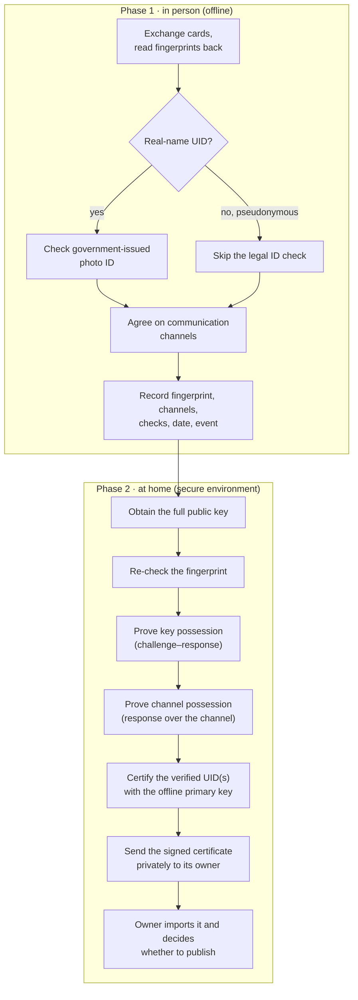
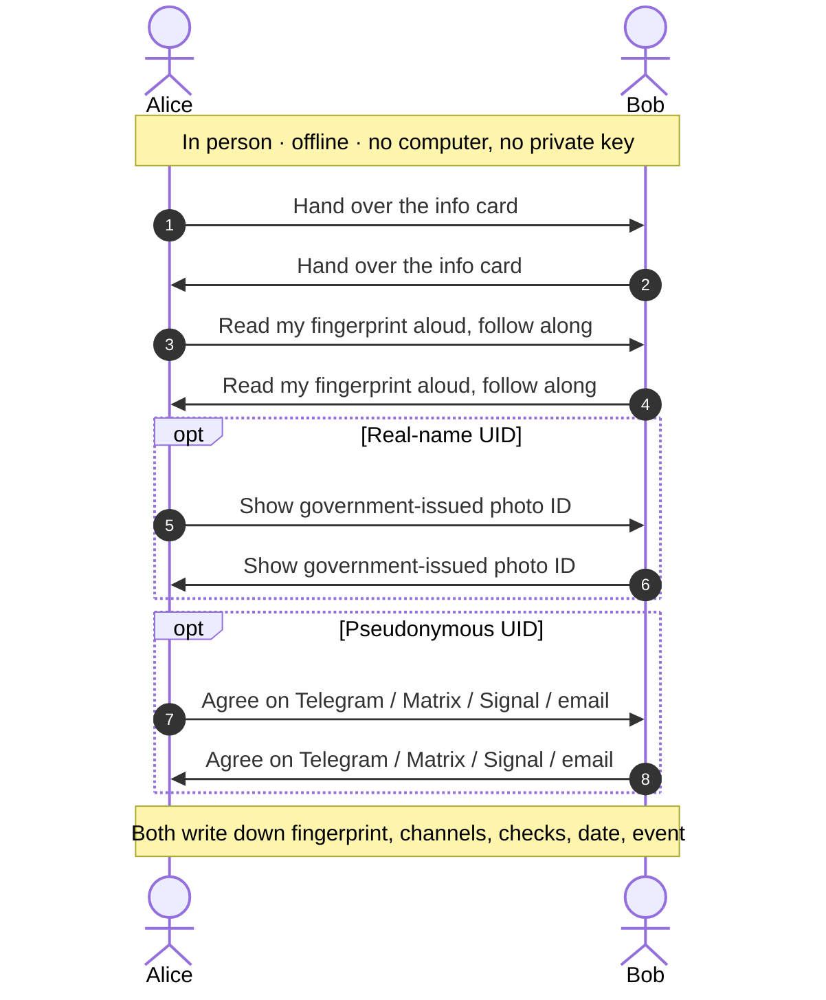
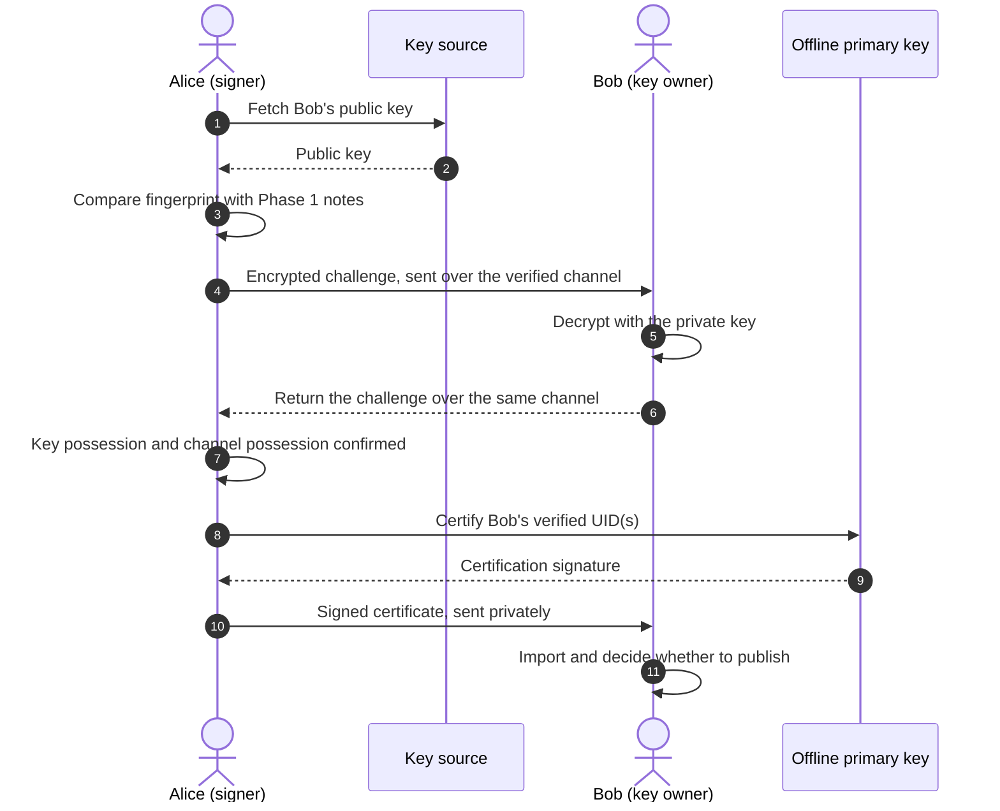
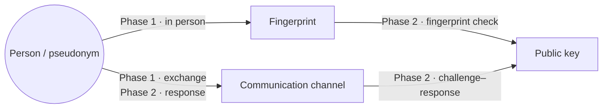

# PGP Info Card

English · [简体中文](README.zh.md)

A [Typst](https://typst.app/) template for a 90 × 55 mm card used at the **in-person phase of an OpenPGP key signing party**: the front carries your key's fingerprint, its User IDs, and the contact channels that should be verified against the key; the back carries the same fingerprint as a QR code.

Start a new card from the template:

```sh
typst init @preview/pgp-info-card:0.1.0 my-card
cd my-card
$EDITOR main.typ
typst compile main.typ
```

The PDF holds both versions of the same card: the single card on pages 1–2 (front, back) and two A4 sheets on pages 3–4 with ten copies each (fronts, backs) and crop marks. Print the A4 sheets double-sided on plain paper and cut along the crop marks; every copy is identical, so any duplex mode lines up. Print pages 1–2 instead if you want a single card at business-card size. Set `layouts` to `("card",)` or `("a4",)` to emit only one of the two.

## The two-phase keysigning process

A key signing party proves, in person, that a fingerprint belongs to the person (or pseudonym) presenting it. The OpenPGP certification itself is produced later, at home, with the private key — ideally an offline primary certification key. Splitting the process this way keeps the private key away from the event, where it could be exposed to compromised machines, and keeps the in-person part as simple as a fingerprint and a pen.



### Phase 1 — in person (offline)

1. Prepare your card (this repository) or plain fingerprint slips (`gpg-key2ps`), and know your own fingerprint well enough to check it.
2. Exchange cards with each person. Read your fingerprint aloud and have the other party follow along; both parties write down (or scan) the other's fingerprint. Compare the full fingerprint — the QR code is only a convenience.
3. If the key's User ID is a real name, check a government-issued photo ID, per the event's or the two parties' signing policy. If the User ID is a pseudonym, no legal identity check is needed; instead, agree on the online channel (Telegram, Matrix, Signal, email, …) through which that pseudonym can be reached.
4. Record what you verified: fingerprint, channel(s), what was checked, date, and event. At list-based parties, tick the "Fingerprint OK" and "ID OK" boxes on the printed participant list — that annotated list can later be fed to `caff` directly.
5. Leave the private key at home. Nothing in this phase needs a computer or a network.



If you already know the other party through an authenticated channel (for example a previously verified Signal safety number, or long-standing correspondence), the in-person step can be reduced to exchanging and checking the fingerprint — but the Phase 2 checks below still apply. Skipping the in-person step entirely is possible, but then it is no longer a key signing party.

### Phase 2 — at home (secure environment)

1. Obtain the full public key from a reliable source: directly from its owner over an already verified channel, or from a keyserver. Then compare the **full fingerprint** against your Phase 1 record. Don't trust the source; trust the fingerprint.
2. Verify key possession with a challenge–response: encrypt a fresh, random challenge with the other party's public key and send it over the verified channel; require the plaintext back. Naming the verified primary fingerprint as recipient is enough — GnuPG picks an encryption-capable subkey on its own. If you specifically need signing capability, ask for a signature over the challenge made by the signing subkey (see the notes below).
3. Verify channel possession: the response must arrive over the channel agreed in Phase 1. That confirms the key owner still controls the channel — and, for a pseudonymous UID, is what binds the key to the pseudonym.
4. Certify only the User ID(s) whose binding you actually verified, with the primary key, in an offline environment (for example `gpg --ask-cert-level --sign-key <fingerprint>`, or `gpg --quick-sign-key <fingerprint> '<uid pattern>'` to pick individual UIDs). Choose a certification level that reflects how thoroughly you verified the identity.
5. Export the certification (or the updated certificate) and send it privately to the key owner over a verified channel. Let the owner decide whether to publish it. Never upload someone else's key to a keyserver without their consent.



### What gets bound to what



| Binding | Established in | Verified by |
| --- | --- | --- |
| Person / pseudonym ↔ fingerprint | Phase 1 (in person) | Photo ID, or agreement on a channel |
| Person / pseudonym ↔ channel | Phase 1 (exchange) + Phase 2 (response) | Challenge–response over that channel |
| Fingerprint ↔ public key | Phase 2 | Local fingerprint comparison |
| Public key ↔ private key | Phase 2 | Decrypting the challenge (encryption subkey) |

### Notes and pitfalls

- **Possession proof stops at the subkey.** A challenge encrypted with the key is decrypted by an encryption subkey's private key, so it proves control of *that subkey*, not of the primary key that issues certifications. This is the model `caff` uses and is generally accepted; if your policy demands more, ask for a fresh signature made by the primary key. A signature made by a signing subkey proves only that subkey — it still does not prove the primary key's private key.
- **One fingerprint per key.** The fingerprint exchanged in Phase 1 and compared in Phase 2 is the primary key's. Subkeys have fingerprints of their own, but they carry no User IDs and are bound to the primary by the primary key's subkey binding signatures, so they are never verified separately.
- **Certifications are per UID.** OpenPGP certifications are issued by the primary key over individual User IDs. Verify and certify only the UIDs whose binding you checked — the email address that answered, the pseudonym whose channel answered, the name on the ID you saw. `caff` sends one email per UID precisely for this reason.
- **Fingerprint lengths differ.** The template is laid out for a 40-hex-digit v4 fingerprint (SHA-1). v6 keys ([RFC 9580](https://www.rfc-editor.org/rfc/rfc9580.html)) have 64-hex-digit fingerprints (SHA-256) and need a wider or two-line layout; the experimental v5 keys from the `--rfc4880bis` drafts have the same length.
- **Publishing is the owner's call.** Never upload someone else's key or your certification to a keyserver without consent. Note that [keys.openpgp.org](https://keys.openpgp.org/about/faq) does not distribute third-party certifications by default (only first-party attested ones), so signatures made at a key signing party do not propagate through it; traditional keyservers and project keyrings (e.g. Debian's) behave differently.
- **Certifications are revocable.** If a verification later turns out to be wrong, revoke the certification (`gpg --edit-key` → `revsig`), and keep your own key's revocation certificate somewhere safe.

## Automating Phase 2 with `caff`

The `caff` tool from the [`signing-party`](https://salsa.debian.org/signing-party-team/signing-party) package automates the post-party work: fetching keys, checking them against the annotated participant list, signing, and returning the signatures.

The canonical workflow:

1. Before the party, the organizer generates the participant list with `gpgparticipants` (including checksum lines) and publishes it.
2. At the party, each participant verifies fingerprints and identities and ticks the "Fingerprint OK" and "ID OK" boxes (and the checksum boxes) on their own printed copy.
3. At home:

   ```sh
   caff < ksp-annotated.txt
   ```

   `caff` fetches the keys (or uses `--key-file` / `--keys-from-gnupg`), signs **only** the keys whose "Fingerprint OK" and "ID OK" boxes are ticked, and then mails each User ID its signed key, encrypted to the key itself.

4. The recipient decrypts the mail with the private key, imports the signature, and decides whether to publish.

Caveats:

- **`caff` does not do a challenge–response round-trip.** It signs first, then delivers the signed key encrypted to the key itself: only someone holding the private key can decrypt it, but the signer receives no explicit confirmation. If you want positive confirmation, do the manual challenge–response before signing, or skip `caff`'s mailing step (`-m no`).
- `caff`'s mails go to email UIDs, so pseudonymous keys without email addresses need manual handling.
- `caff` uses its own GnuPG home (`~/.caff/gnupghome`); keyserver settings belong in `~/.caff/gnupghome/gpg.conf`. Set `ask-sign` in `~/.caffrc` to pause before signing, which is useful when the primary key lives offline.

## The card

The template takes the following arguments (edit them in `main.typ`):

- `display-name`
- `fingerprint` (formatted in groups of four hex digits), shown under the name
- `uids` — up to six one-line entries (guarded by `max-uids`; a longer UID wraps onto an indented second line)
- contact channels: `telegram`, `matrix`, `website`, `github` (a channel set to `none` or `""` is omitted)
- `note` — a short line at the bottom (defaults to "Verify the fingerprint before trusting this key.")
- `layouts` — which outputs to emit: `("card", "a4")` by default, or `("card",)` / `("a4",)`

Each A4 sheet tiles ten copies in a 2 × 5 grid of 90 × 55 mm cards, with 15 mm / 11 mm margins and 4 mm crop marks in the margins. The QR code on the back encodes the fingerprint without whitespace, so scanning it yields exactly the string you compare against the downloaded key in Phase 2.

## Development

The repository follows the [Typst packages](https://github.com/typst/packages) layout: `lib.typ` is the package entrypoint, and `template/` is what `typst init` copies. To test a clone without publishing:

```sh
mkdir -p /tmp/typst-packages/preview/pgp-info-card
ln -s "$PWD" /tmp/typst-packages/preview/pgp-info-card/0.1.0
typst init --package-path /tmp/typst-packages @preview/pgp-info-card:0.1.0 /tmp/my-card
typst compile --package-path /tmp/typst-packages /tmp/my-card/main.typ
```

## References

Background:

- [The Keysigning Party HOWTO](https://www.cryptnet.net/fdp/crypto/keysigning_party/en/keysigning_party.html) — the classic guide, including the Zimmermann–Sassaman method.
- [Wikipedia: Key signing party](https://en.wikipedia.org/wiki/Key_signing_party)
- [Wikipedia: Zimmermann–Sassaman key-signing protocol](https://en.wikipedia.org/wiki/Zimmermann%E2%80%93Sassaman_key-signing_protocol)

Practical guidance and real-world events:

- [Debian: Keysigning](https://www.debian.org/events/keysigning.en.html) — how to run a keysigning session.
- [Debian Wiki: Keysigning](https://wiki.debian.org/Keysigning) and [Keysigning/Offers](https://wiki.debian.org/Keysigning/Offers)
- [DebConf 10 keysigning example](https://people.debian.org/~anibal/ksp-dc10/ksp-dc10.html)

Tools:

- [`signing-party`](https://salsa.debian.org/signing-party-team/signing-party) — `caff`, `gpgparticipants`, `gpg-key2ps`, and friends.
- [`caff(1)`](https://manpages.debian.org/unstable/signing-party/caff.1.en.html), [`gpgparticipants(1)`](https://manpages.debian.org/unstable/signing-party/gpgparticipants.1.en.html), [`gpg-key2ps(1)`](https://manpages.debian.org/unstable/signing-party/gpg-key2ps.1.en.html)
- [Debian business-card templates](https://www.debian.org/events/materials/business-cards/) — an alternative to fingerprint slips.

Specifications and key servers:

- [GnuPG manual: OpenPGP Key Management](https://gnupg.org/documentation/manuals/gnupg/OpenPGP-Key-Management.html)
- [RFC 9580 — OpenPGP](https://www.rfc-editor.org/rfc/rfc9580.html)
- [keys.openpgp.org FAQ](https://keys.openpgp.org/about/faq) — why third-party certifications are not distributed by default.

## License

[MIT](LICENSE)
