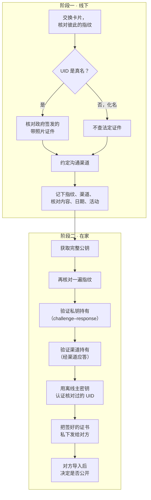
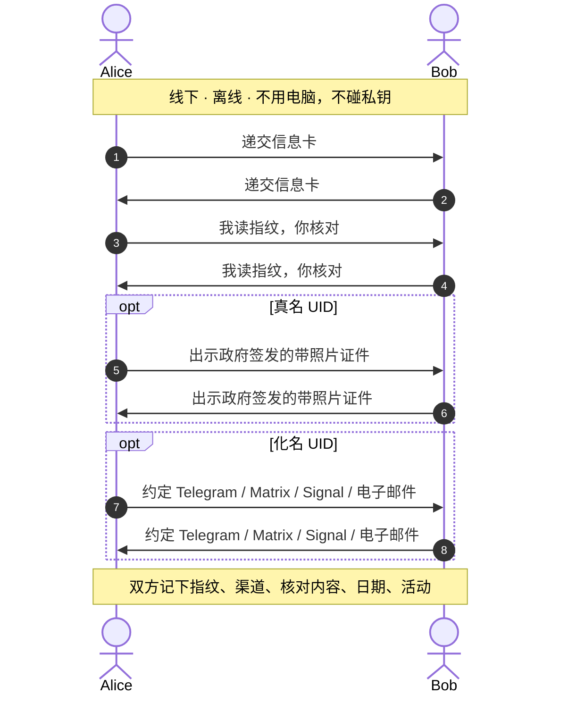
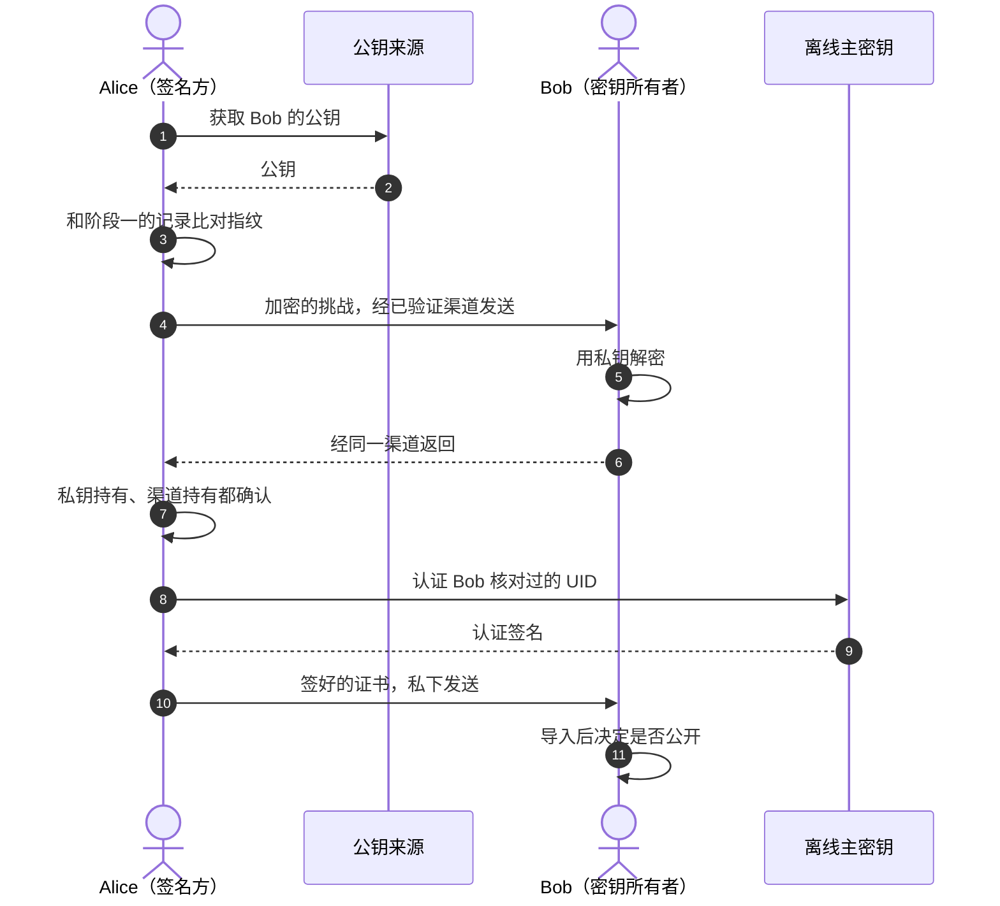
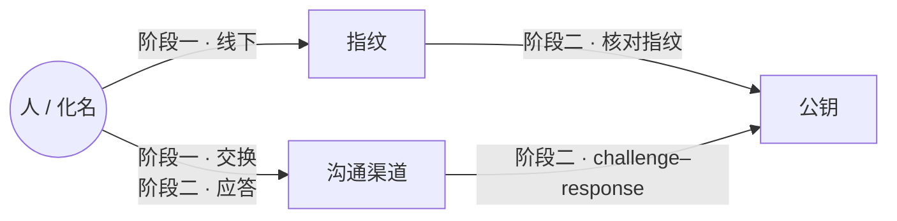

# Key signing party

[English](key-signing-party.md) · 简体中文

[PGP 信息卡](../README.zh.md) 的流程文档：线下怎么交换卡片、回家认证之前要核对什么，以及怎么用 `caff` 自动化聚会后的工作。

## 两阶段的 keysigning 流程

key signing party 的意义，就是当面确认某个指纹确实属于出示它的人（或化名）。OpenPGP 认证本身等回家再做，用私钥签——最好用离线的、只做认证的主密钥。这样拆开，私钥不用出现在活动现场（现场机器未必干净），线下环节也简单，一张卡片、一支笔就够了。



### 阶段一 —— 线下

1. 准备好卡片（[PGP 信息卡](../README.zh.md)），或者用 `gpg-key2ps` 打普通指纹纸条；自己的指纹要熟到能核对。
2. 和每个人交换卡片。你读出自己的指纹，对方跟着核对；双方各自记下（或扫描）对方的指纹。一定核对完整指纹——QR 码只是顺手用的。
3. UID 是真名，就按活动或双方约定的签名规则核对政府签发的带照片证件；UID 是化名，不用查证件，改成约定一个能找到这个化名的在线渠道（Telegram、Matrix、Signal、电子邮件等）。
4. 把核对过的东西记下来：指纹、渠道、核对内容、日期、活动。按名单进行的活动，就在打印的名单上勾选 "Fingerprint OK" 和 "ID OK"——这份标注过的名单之后可以直接喂给 `caff`。
5. 私钥留在家里。这一步不用电脑，也不用联网。



如果你们本来就在某个已验证的渠道上认识（比如核对过 Signal 安全码，或者长期通信），线下这步可以缩到只交换、核对指纹——但阶段二的检查还是得做。跳过线下环节也不是不行，只是那样就不算 key signing party 了。

### 阶段二 —— 在家

1. 从可靠来源拿完整公钥：通过已验证的渠道直接向本人要，或者从 keyserver 下载。然后拿**完整指纹**和阶段一的记录比对。来源可以不信，指纹必须信。
2. 用 challenge–response 验证对方持有私钥：用对方的公钥加密一个新的随机挑战，经已验证渠道发过去，要求把明文发回来。recipient 填阶段一核对过的主密钥指纹即可，GnuPG 会自己挑一个可加密的 subkey。如果更看重签名能力，也可以请对方用签名 subkey 对挑战签名（见下面的注意事项）。
3. 验证渠道持有：应答必须从阶段一约定的渠道回来。这能说明密钥主人还握着那个渠道——化名 UID 之所以能绑到密钥上，靠的就是这一步。
4. 只认证你确实核对过绑定关系的 User ID，在离线环境用主密钥签（例如 `gpg --ask-cert-level --sign-key <fingerprint>`，或者用 `gpg --quick-sign-key <fingerprint> '<uid pattern>'` 挑单个 UID）。认证级别和核对程度要对得上。
5. 把认证（或更新后的证书）导出来，通过已验证渠道私下发给本人，由本人决定要不要公开。没有同意，别把别人的密钥传上 keyserver。



### 什么绑定了什么



| 绑定 | 建立于 | 靠什么验证 |
| --- | --- | --- |
| 人 / 化名 ↔ 指纹 | 阶段一（线下） | 带照片证件，或约定某个渠道 |
| 人 / 化名 ↔ 渠道 | 阶段一（交换）+ 阶段二（应答） | 经该渠道的 challenge–response |
| 指纹 ↔ 公钥 | 阶段二 | 本地比对指纹 |
| 公钥 ↔ 私钥 | 阶段二 | 解密挑战（加密 subkey） |

### 注意事项

- **私钥持有证明止步于 subkey。** 挑战是用对方的公钥加密的，但只有加密 subkey 的私钥能解开，所以证明的是对方握有*那个 subkey* 的私钥，而不是签发认证的主密钥。`caff` 就是这么做的，大家一般也接受；要求更高的话，可以请对方用主密钥重新签一次。签名 subkey 做的签名也只能证明那个 subkey，证明不了主密钥的私钥。
- **一把 key 只有一个要核对的指纹。** 阶段一交换、阶段二比对的都是主密钥的指纹。subkey 也有自己的指纹，但上面没有 User ID；它们与主密钥的绑定由主密钥签发的 subkey binding signature 保证，不用逐个核对。
- **认证按 UID 分别签。** OpenPGP 认证由主密钥对单个 User ID 签发。只认证你确实核对过绑定关系的 UID——回信的邮箱、渠道有应答的化名、证件上的姓名。`caff` 每个 UID 单独发一封信，就是为这个。
- **指纹长度不一样。** 卡片按 40 位十六进制字符的 v4 指纹（SHA-1）排版。v6 密钥（[RFC 9580](https://www.rfc-editor.org/rfc/rfc9580.html)）是 64 位（SHA-256），需要更宽或者分两行的布局；`--rfc4880bis` 草案里的实验性 v5 密钥长度一样。
- **公不公开由本人决定。** 没有同意，别把他人的密钥或你的认证传上 keyserver。[keys.openpgp.org](https://keys.openpgp.org/about/faq) 默认不传播第三方认证（只传播第一方自证的），所以在 key signing party 上签的名不会经它扩散；传统 keyserver 和项目 keyring（比如 Debian 的）另说。
- **认证可以撤销。** 事后发现核对错了，就撤销认证（`gpg --edit-key` → `revsig`）；自己密钥的吊销证书也要收好。

## 用 `caff` 自动化阶段二

[`signing-party`](https://salsa.debian.org/signing-party-team/signing-party) 里的 `caff` 能接管聚会之后的活：下载密钥、按标注过的名单核对、签名、再把签名寄回来。

通常的流程：

1. 活动前，组织者用 `gpgparticipants` 生成参与者名单（带校验和行）并发布。
2. 活动上，每人核对指纹和身份，在自己那份打印名单上勾选 "Fingerprint OK"、"ID OK"（还有校验和）方框。
3. 回家后：

   ```sh
   caff < ksp-annotated.txt
   ```

   `caff` 会下载密钥（也可以用 `--key-file` / `--keys-from-gnupg`），只给 "Fingerprint OK" 和 "ID OK" 都勾上的密钥签名，然后把每个 User ID 的已签名密钥寄到该 UID 的邮箱，用密钥自身加密。

4. 对方用私钥解密、导入签名，再决定是否公开。

几点注意：

- **`caff` 不做 challenge–response。** 它先签名，再把签名后的密钥用密钥自身加密寄出：只有拿着私钥的人能解开，但签名的人收不到明确回执。想要确认，就在签名前手动做一轮 challenge–response，或者跳过 `caff` 的发信步骤（`-m no`）。
- `caff` 只往电子邮件 UID 发信，所以没有邮箱的化名密钥得手动处理。
- `caff` 有自己的 GnuPG 目录（`~/.caff/gnupghome`），keyserver 之类的设置要写进 `~/.caff/gnupghome/gpg.conf`。在 `~/.caffrc` 里设 `ask-sign`，签名前会停下来等你，主密钥离线时很有用。

## 参考资料

背景：

- [The Keysigning Party HOWTO](https://www.cryptnet.net/fdp/crypto/keysigning_party/en/keysigning_party.html) —— 经典指南，含 Zimmermann–Sassaman 方法。
- [Wikipedia：Key signing party](https://en.wikipedia.org/wiki/Key_signing_party)
- [Wikipedia：Zimmermann–Sassaman key-signing protocol](https://en.wikipedia.org/wiki/Zimmermann%E2%80%93Sassaman_key-signing_protocol)

实践经验：

- [Debian：Keysigning](https://www.debian.org/events/keysigning.en.html) —— 怎么组织一场 keysigning。
- [Debian Wiki：Keysigning](https://wiki.debian.org/Keysigning) 和 [Keysigning/Offers](https://wiki.debian.org/Keysigning/Offers)
- [DebConf 10 的 keysigning 示例](https://people.debian.org/~anibal/ksp-dc10/ksp-dc10.html)

工具：

- [`signing-party`](https://salsa.debian.org/signing-party-team/signing-party) —— `caff`、`gpgparticipants`、`gpg-key2ps` 等。
- [`caff(1)`](https://manpages.debian.org/unstable/signing-party/caff.1.en.html)、[`gpgparticipants(1)`](https://manpages.debian.org/unstable/signing-party/gpgparticipants.1.en.html)、[`gpg-key2ps(1)`](https://manpages.debian.org/unstable/signing-party/gpg-key2ps.1.en.html)
- [Debian 名片模板](https://www.debian.org/events/materials/business-cards/) —— 指纹纸条之外的另一条路。

规范与 keyserver：

- [GnuPG 手册：OpenPGP Key Management](https://gnupg.org/documentation/manuals/gnupg/OpenPGP-Key-Management.html)
- [RFC 9580 —— OpenPGP](https://www.rfc-editor.org/rfc/rfc9580.html)
- [keys.openpgp.org FAQ](https://keys.openpgp.org/about/faq) —— 为什么默认不传播第三方认证。
